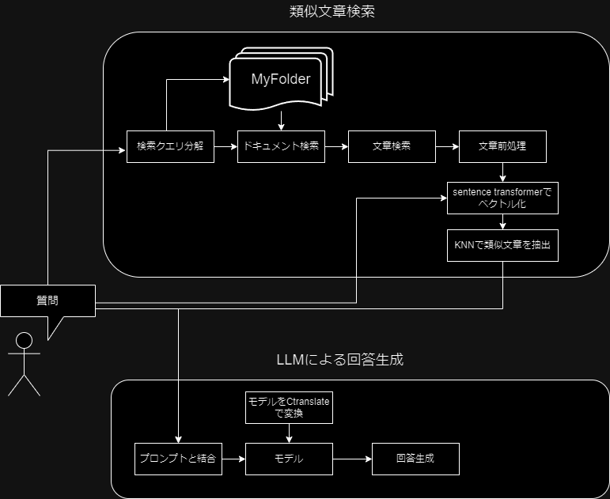
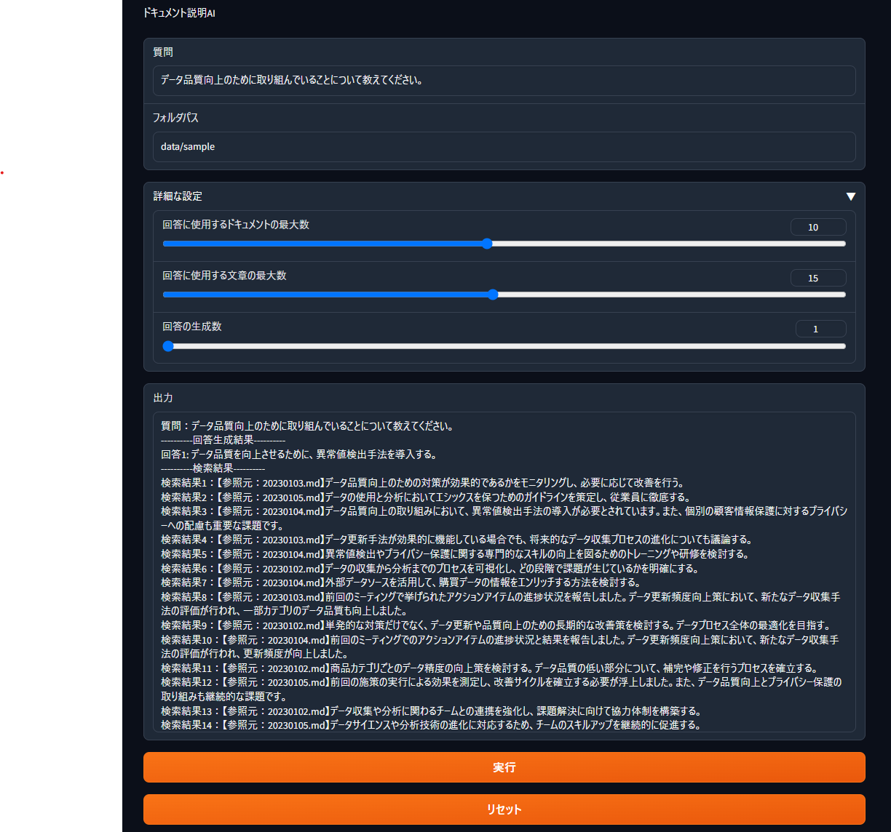
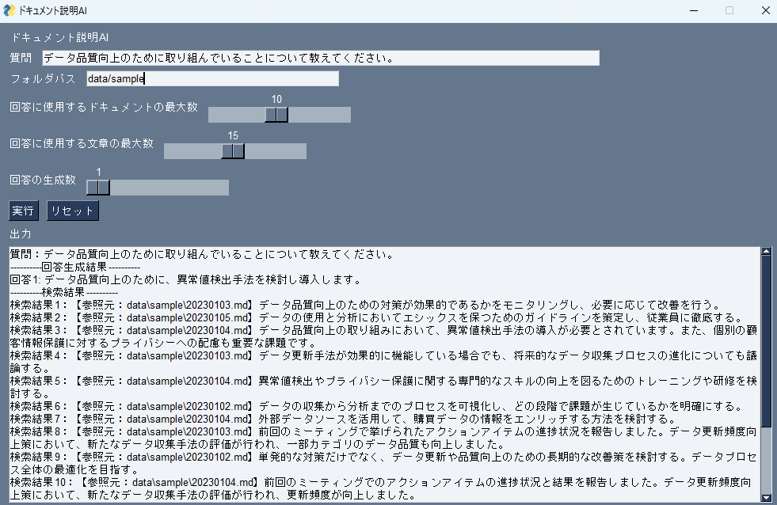

# ドキュメント説明AI


## 概要

この「ドキュメント説明AI」というアプリは、エンジニアではない人々でも使いやすいように設計されたツールです。このアプリの主な目的は、与えられた質問に関連するドキュメントや文章を効果的に取り出してわかりやすく説明することです。とくに注目すべき特徴として、**一般的なローカル環境で動作するため、セキュリティリスクの心配が不要**です。以下では、アプリの主な機能について説明します。


対象データ形式：markdown

※`data/template/template.md`に準拠したファイルを推奨

### 検索クエリ分解
1. 質問文からJanomeで非自立名詞以外の名詞を抽出
2. 1で抽出した名詞を用いて2~4gramを作成
3. 2での生成物を検索クエリとする。
### ドキュメント検索
1. 検索クエリを含むドキュメントを指定フォルダーから抽出
2. 1で抽出したドキュメントの検索クエリを含む数を降順に見たときの上位max_doc個抽出し、ドキュメントの検索結果とする。

### 文章検索
1. 文章をチャンク化する。
2. 検索クエリを含むチャンク化した文章を抽出
3. 2で抽出した文章を文章の検索結果とする。

### 文章前処理
1. 検索結果の文章の不正文字やカッコUnicodeなどを除去

### 文章と質問をベクトル化
1. Sentence Transformerで検索結果文章と質問をベクトル化

### KNNで類似文章を抽出
1. 質問文と類似度が高い検索結果文章をmax_results個抽出
2. 1の結果を検索結果とする。

### LLMを用いた回答
1. 検索結果と質問文をプロンプトと結合
2. Ctranslate2でLLMを変換
3. プロンプトと変換したLLMで回答生成
## 使い方
### 実行環境
- OS: Windows 11 pro
- CPU: Rythen5 PRO 5650U
- GPU: AMD Radeon(TM) Pro Graphics (CPU内蔵GPU)
- MEMORY: 16GB
### 実行方法

1. 環境構築

前提として、poetryがインストールされている必要があります。

```sh
git clone https://github.com/jumtra/doc_explanation.git
poetry install
```

2. 実行

実行方法は、3種類あります。

- cliで実行する場合

```sh
poetry run doc_explain
```
以下CLIで有効な引数の一覧

```
options:
  -h, --help            show this help message and exit
  --data_path DATA_PATH
                        ドキュメントが存在するディレクトリの絶対パスを指定
  --question QUESTION   質問内容
  --max_results MAX_RESULTS
                        検索結果から参照する最大文章数
  --max_doc MAX_DOC     検索結果から参照する最大ドキュメント数
  --generate_num GENERATE_NUM
                        回答の生成数
```

- ローカルサーバとして実行する場合

localhostでgradioに接続する形になります。
ファイアーウォールの設定によっては、ローカルで起動できない可能があります。

```sh
poetry run doc_app
```


実行例
1. 質問を入力
2. フォルダパスに対象フォルダーの絶対パスを入力
3. 実行を押して30秒程待つと結果が出力される。




- ローカルアプリとして実行する場合

ファイアーウォールの関係でgradioが起動できない場合はこちらをお試しください。
※windows 11では実行確認済み

```sh
poetry run local_app
```

実行例
1. 質問を入力
2. フォルダパスに対象フォルダーの絶対パスを入力
3. 実行を押して30秒程待つと結果が出力される。


## 使用モデル

|使用用途|モデル名|リンク| 商用利用|
|---|---|---|---|
|文章のベクトル化|all-MiniLM-L6-v2|https://huggingface.co/sentence-transformers/all-MiniLM-L6-v2|可能|
|回答生成|Jumtra/rinna-3.6b-tune-ep5|https://huggingface.co/Jumtra/rinna-3.6b-tune-ep5|可能|

## サンプルデータ
`data/sample`内ダミーのデータは、
gpt3.5-turboで以下のプロンプトを使って生成させた。

```
以下プロンプトで適当な議事録を生成させた。
あなたは、データサイエンティストです。
あなたは、顧客の購買データを用いた分析の方針についてミーティングを行いました。
ミーティングの議事録を以下のフォーマットで記述してください.
出力結果は、必ずmarkdownのコード形式にしてください。
# 決定事項
## hoge1
## hoge2
# TODO
## hoge1
## hoge2
# MEMO
## hoge1
## hoge2
```

続けて生成する場合のプロンプトは以下
```
前回の会議で決まらなかったことや新たな課題点について同じ顧客とミーティングを行いました。
ミーティングの議事録を同様のフォーマットで記述してください
```